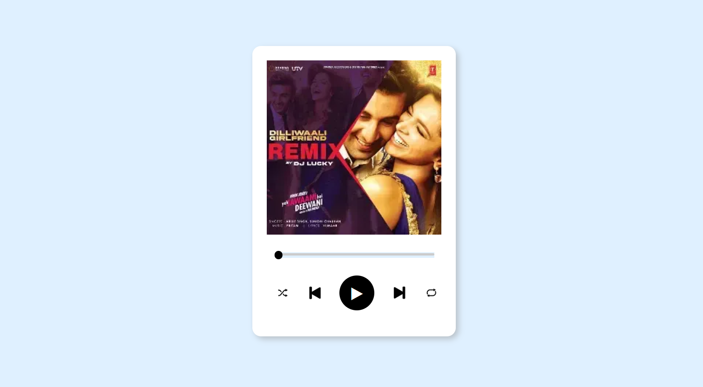

# 🎵 Modern Music Player

A visually appealing and interactive music player web app featuring a neumorphism-inspired design. This music player includes a smooth animated progress bar with a moving black thumb (dot), play/pause controls, and a sleek UI layout.

## 📸 Preview

## 🚀 Features

- Custom-designed modern UI using HTML and CSS
- Play/Pause functionality with icon toggle
- Black-colored progress bar that updates with audio time
- Smooth-moving black thumb (dot) to indicate progress
- Clickable progress bar to jump to any time in the track

## 🧰 Technologies Used

- HTML5
- CSS3
- JavaScript (Vanilla)

## 🛠 How It Works

- When you click the ▶️ Play button, music starts playing and the button toggles to ⏸ Pause.
- The black progress bar starts filling as the music progresses.
- A black dot (thumb) moves along with the progress bar.
- Clicking anywhere on the bar will change the current time of the audio.

## 📦 Setup Instructions

1. Clone or download this repository.
2. Replace `song.mp3` with your desired audio file.
3. Open `index.html` in your browser.

## ✨ Customization Tips

- Update `banner.png` and `music-icon.png` to change the visual style.
- You can add current time / duration display for a more advanced look.
- Easily extend the player with next/previous song features.

## 📄 License

This project is open-source and free to use.

---

Made with ❤️ using HTML, CSS & JavaScript

